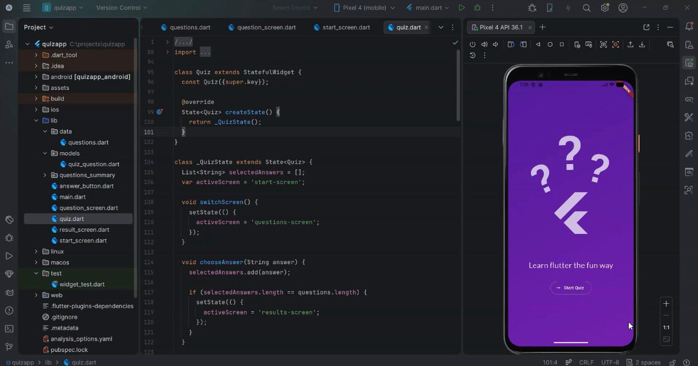

# Flutter Quiz App

## Overview
This is a dynamic quiz application built using Flutter. The app presents a sequence of questions, records user responses, and displays a result summary comparing selected answers with the correct ones.

The project is designed with a focus on clean architecture and reusability by separating logic, UI components, and data into different files.

---

## Features

- Dynamic question flow
- Multiple choice answers
- Result screen with answer comparison
- Clean and minimal UI
- Reusable and modular code structure

---

## Screens

### Start Screen
Initial screen with a button to begin the quiz.

### Questions Screen
Displays questions and allows users to select answers.

### Results Screen
Shows selected answers alongside correct answers for evaluation.

---

## Code Structure (Reusable Design)

The project is divided into separate files to ensure scalability and reusability:

---

## Reusability

The app is built using a modular approach:
- UI components like buttons are separated into reusable widgets
- Question data is managed independently
- Logic and screens are split into dedicated files

This structure makes the app easy to maintain, extend, and reuse in other projects.

---

## Tech Stack

- Flutter
- Dart

---

## Future Improvements

- Restart quiz functionality
- Score calculation
- Timer-based quiz
- API integration for dynamic questions

---

## Author

Rahat e Batool
